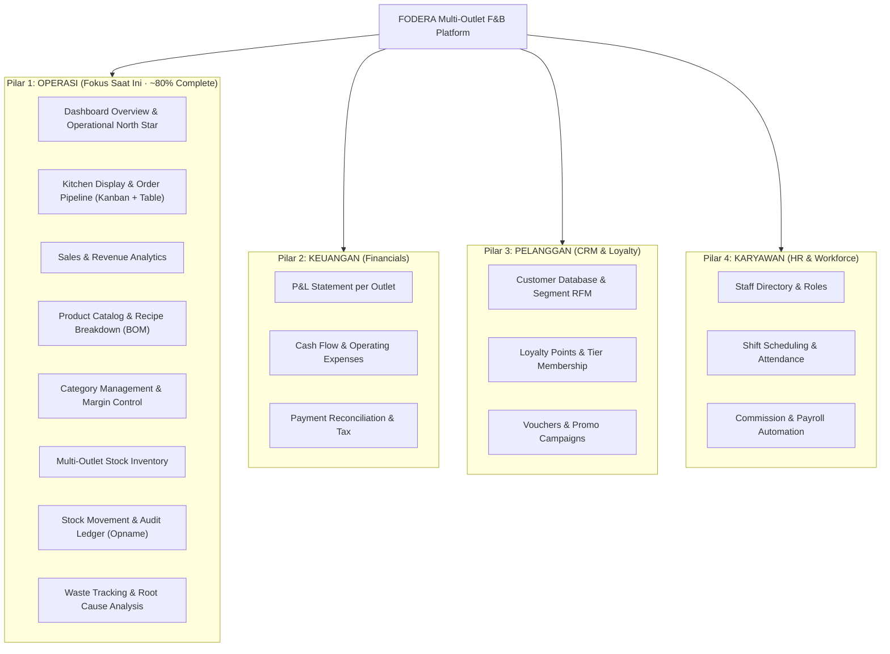

# FODERA — Multi-Outlet F&B SaaS Operating System

<div align="center">

**Next-Gen Cloud POS, Kitchen Workflow, Inventory Audit & Multi-Outlet Management Platform for Modern F&B Brands.**

*Demo Brand: Kopi Senja (Cabang Malang, Surabaya, Jakarta)*

[](https://react.dev/)
[](https://www.typescriptlang.org/)
[](https://vitejs.dev/)
[](https://tailwindcss.com/)
[](https://phosphoricons.com/)
[]()

</div>

---

## 📌 Ringkasan Proyek

**FODERA** adalah platform SaaS terpadu yang dirancang khusus untuk operasional bisnis Food & Beverage (F&B) multi-outlet. FODERA menyederhanakan manajemen pesanan dapur (*Kitchen Display System*), pergerakan inventaris dan bahan baku (*Bill of Materials/BOM*), pelacakan limbah (*waste tracking*), serta analitik pendapatan kasir dan omzet harian.

---

## 🏛️ Arsitektur 4 Pilar Bisnis

Arsitektur FODERA dibangun di atas 4 pilar fungsional utama F&B:



---

## 🚀 Fitur Pilar 1 — OPERASI (Detail Implementasi)

### 1. Dashboard Overview
- **Operational North Star**: 4 KPI kartu metrik (*Gross Revenue, Net Sales, Total Orders, Average Order Value*).
- **Activity Striped Bar Chart**: Chart visual dengan arsiran garis miring diagonal (*high-density diagonal hatching*), bar highlight `accent1` (Warm Coral), floating badge transaksi, dan interaksi hover dinamis.
- **Category Progress Bar**: Bar kontribusi kategori menu dengan batas miring (*slanted boundary*) 45° sejajar motif arsiran.
- **Snapshot Antar-Outlet**: Perbandingan performa *real-time* outlet Malang, Surabaya, dan Jakarta.
- **Operational Alerts**: Notifikasi kritis stok menipis dan verifikasi kasir.

### 2. Order Management & Kitchen Display (KDS)
- **Dual View Toggle**: Beralih instan antara **Kanban Board 4 Kolom** dan **Tabel Pesanan**.
- **Pipeline Antrean Dapur**: *Pesanan Baru* ➔ *Sedang Diracik* ➔ *Siap Disajikan* ➔ *Selesai Diambil*.
- **Order Cards Lengkap**: Nama pelanggan, tipe layanan (*Dine In / Takeaway / Delivery*), nomor meja, daftar menu, catatan khusus (*e.g., less sugar, oatmilk*), dan total tagihan.
- **Order Detail Modal**: Popup rincian pesanan lengkap dengan kanal pemesanan (*GoFood, GrabFood, Kasir*) dan metode pembayaran (*QRIS, EDC, Tunai*).

### 3. Sales & Revenue Analytics
- **Multi-Filter**: Filter berdasarkan rentang tanggal (*Hari Ini, Kemarin, 7 Hari, Bulan Ini*) dan cabang outlet.
- **Visual Activity Chart**: Chart aktivitas penjualan mingguan berarsir rapat (*high-density hatching*).
- **Kanal Penjualan (Channel Mix)**: Distribusi omzet *Dine In* (58%), *Takeaway* (26%), dan *Delivery* (16%) lengkap dengan progress bar berarsir diagonal.
- **Rekonsiliasi Pembayaran**: Rasio QRIS (62%), Kartu Debit (24%), dan Tunai (14%) serta tingkat penetrasi transaksi *cashless* 86%.

### 4. Menu & Product Management (BOM)
- **Product Catalog**: Filter kategori (*Coffee, Non-Coffee, Bakery, Heavy Meal*) dan badge performa (*Top Seller, Good Margin, Review Recipe*).
- **Recipe Breakdown Modal (Bill of Materials / BOM)**: Modal komposisi resep bahan baku per cup, takaran gram/ml, biaya per unit, total HPP (*Cost of Goods Sold*), dan margin laba kotor.
- **Instant Stock Toggle**: Pengalihan status produk "Tersedia" ↔ "Habis (Sold Out)" secara langsung.

### 5. Category Management
- Ringkasan KPI kategori menu, target margin rata-rata, dan manajemen deskripsi menu.

### 6. Multi-Outlet Stock Inventory
- **Safety Stock Threshold**: Indikator batas aman bahan baku (*Kritis, Menipis, Aman*).
- **Restock Action Modal**: Modal restok fungsional dengan kalkulasi otomatis kuantitas masuk, tanggal kedaluwarsa, dan pembaruan status stok seketika.

### 7. Stock Movement & Audit Ledger
- **Buku Besar Mutasi Stok**: Riwayat audit mutasi stok lengkap (*Penerimaan PO, Pemakaian Penjualan, Transfer Antar-Cabang, Penyesuaian Opname, Pembuangan Basi*).
- **Stock Opname Modal**: Form pencatatan stok fisik aktual vs sistem dengan kalkulasi deviasi/selisih dan alasan koreksi.

### 8. Waste Tracking & Root Cause Analysis
- **Pencatatan Limbah Bahan Baku**: Kategori penyebab limbah (*Expired / Kedaluwarsa, Rusak Penyimpanan, Kesalahan Barista, Gagal Masak*).
- **Root Cause & Preventive Actions**: Rekomendasi mitigasi pencegahan kerugian (*First-In First-Out, kalibrasi grinder, pelatihan steaming susu*).
- **Add Waste Modal**: Modal input limbah dengan estimasi nilai kerugian finansial (*Loss Cost*).

---

## 🎨 Design System & Standar Kualitas Kode

Proyek ini menerapkan standar kode ketat (*Enterprise Quality Constraints*):

1. **Zero Arbitrary Classes (`0 [...]`)**:
   - Seluruh ukuran font, margin, padding, dan lebar menggunakan utilitas standar Tailwind v4 (misal: `text-2xs`, `text-xs`, `max-w-8`, `h-3.5`).
   - Tidak ada kelas arbitrary seperti `text-[11px]` atau `w-[300px]`.
2. **Zero Hardcoded Colors**:
   - Tidak ada nilai warna HEX (`#...`) atau `rgb()/hsl()` di dalam file modul UI.
   - Semua warna mengambil dari Design Tokens di `@theme` (`index.css`):
     - `foreground` (`#0f172a` — Slate gelap)
     - `muted-foreground` (`#64748b` — Slate abu-abu)
     - `accent1` (`#ea580c` — Warm Coral)
     - `accent2` (`#10b981` — Fresh Emerald)
     - `secondary` (`#f1f5f9` — Light Slate)
     - `border` (`#e2e8f0` — Border Slate)
3. **100% Phosphor Icons**:
   - Seluruh ikon menggunakan `@phosphor-icons/react` untuk keselarasan visual yang konsisten.
4. **Desain Visual Vektor Asli**:
   - Pola arsiran garis miring diagonal 45° dirender menggunakan SVG vector pattern asli untuk ketajaman maksimal di layar resolusi tinggi/Retina Display.

---

## 🛠️ Tech Stack

- **Framework**: [React 19](https://react.dev/) + [TypeScript](https://www.typescriptlang.org/)
- **Bundler & Dev Server**: [Vite 8](https://vitejs.dev/)
- **Styling**: [Tailwind CSS v4](https://tailwindcss.com/) dengan `@tailwindcss/vite`
- **Typography**: [Plus Jakarta Sans](https://fonts.google.com/specimen/Plus+Jakarta+Sans)
- **Icons**: [@phosphor-icons/react](https://phosphoricons.com/)
- **Routing**: State-Based SPA Router dengan sub-tab modul

---

## 📂 Struktur Direktori

```text
fodera/
├── src/
│   ├── components/
│   │   ├── layout/
│   │   │   ├── Header.tsx              # Top bar, outlet indicator & search
│   │   │   └── Sidebar.tsx             # Collapsible sidebar & outlet switcher
│   │   └── ui/
│   │       ├── alert.tsx               # Alert banner (Phosphor icons)
│   │       ├── badge.tsx               # Status badge variants
│   │       ├── button.tsx              # Button component
│   │       ├── card.tsx                # Card container
│   │       ├── dotted-chart.tsx        # Matrix dot chart component
│   │       ├── metric-card.tsx         # KPI MetricCard component
│   │       ├── modal.tsx               # Reusable dialog/modal
│   │       ├── striped-bar-chart.tsx   # Diagonal striped line chart component
│   │       └── table.tsx               # Styled table components
│   ├── modules/
│   │   ├── dashboard/
│   │   │   └── DashboardOverviewPage.tsx   # Operational North Star Dashboard
│   │   ├── sales/
│   │   │   ├── OrdersPage.tsx              # Kanban & Kitchen Display System
│   │   │   └── SalesAnalyticsPage.tsx      # Revenue, Channel Mix & Payments
│   │   ├── products/
│   │   │   ├── ProductsListPage.tsx        # Product catalog & BOM Recipe modal
│   │   │   └── CategoriesPage.tsx          # Menu categories & margins
│   │   └── inventory/
│   │       ├── StockListPage.tsx           # Multi-outlet stock levels & restock
│   │       ├── StockMovementPage.tsx       # Mutation audit & stock opname
│   │       └── WasteTrackingPage.tsx       # Waste logs & root cause analysis
│   ├── App.tsx                         # Main app routing & state layout
│   ├── index.css                       # Tailwind v4 @theme tokens & utilities
│   └── main.tsx                        # React application entry point
├── .gitignore                          # Git ignore rules (PDF, node_modules, dist)
├── index.html                          # Single page HTML entry
├── package.json                        # Project metadata & dependencies
├── README.md                           # Project documentation
├── tsconfig.json                       # TypeScript compiler configuration
└── vite.config.ts                      # Vite configuration & Tailwind plugin
```

---

## 💻 Memulai (Getting Started)

### Prasyarat
Pastikan Anda telah menginstal:
- [Node.js](https://nodejs.org/) versi 18.0 atau yang lebih baru
- [npm](https://www.npmjs.com/) atau [pnpm](https://pnpm.io/)

### Instalasi Dependensi
```bash
git clone https://github.com/your-username/fodera.git
cd fodera
npm install
```

### Menjalankan Server Development
```bash
npm run dev
```
Aplikasi akan aktif secara default di `http://localhost:5173`.

### Verifikasi & Build Produksi
```bash
npm run build
```
Menjalankan pemeriksaan tipe TypeScript (`tsc`) dan melakukan kompilasi bundel produksi dengan Vite ke folder `dist/`.

---

## 📄 Lisensi

Hak Cipta © 2026 FODERA SaaS Platform. Lisensi di bawah lisensi ISC.
